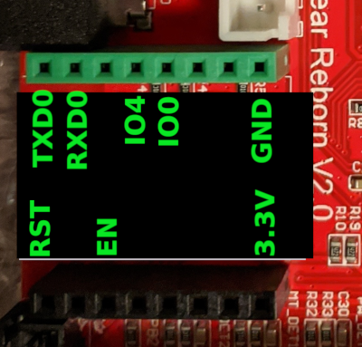

# Прошивка произвольного модуля ESP8266 для работы с FB 4S

## Что это и зачем

Это инструкция как прошить произвольный модуль ESP8266 для работы с 3D принтером FB 4S (плата MKS Robin Nano)

## Какой модуль подойдет

Подойдет любой модуль на ESP8266 с объемом flash не менее 4Мб на котором разведены следующие пины:

* RST
* IO0
* IO4
* TXD0
* RXD0

## Схема подключения

Более подробно про подключение у [MKS](https://github.com/makerbase-mks/MKS-WIFI)

## Что прошивать

Модуль прошивается стандартной прошивкой которая идет в комплекте с прошивкой принтера (файл MksWifi.bin).
Кроме этого надо прошить 21 байт с ID. В оригинальном модуле этот ID содержит MAC адрес модуля, но как показала практика, можно забить MAC нулями (символ 0, hex 0x30) и все будет работать.

## Как прошить

Прошить стандартную прошивку можно через сам принтер, с SD карты как обычно. Но поскольку надо прошить еще дополнительно ID, модуль все равно надо подключать к компьютеру. Поэтому проще прошить все сразу, одним заходом.

Для прошивки используется esptool из SDK от Espressif. Если вы используете для прошивки ESP среду Arduino IDE то у вас уже есть этам программа. Если вы используете для прошивки ESP среду Platformio, то у вас уже есть эта программа. Если вы используете SDK от Espressif для ESP8266 или ESP32, то у вас уже есть эта программа. Просто поищите ее на диске. Если ничего из вышеперечисленного вы не используете, то [esptool](https://github.com/espressif/esptool)

Команда для прошивки:
**esptool.py -p /dev/ttyUSB0 -b 921600 write_flash --erase-all 0x0 MksWifi.bin 0x3fb0c0 21byte.bin**

Параметры:

* **-p /dev/ttyUSB0** Используемый COM-порт. Если у вас Windows, поставьте тут нужный порт, например COM5. Параметр можно опустить, программа сама попытаеся найти нужный порт.
* **-b 921600** Скорость передачи по UART. Если модуль подключен "на сполях", можно поставить меньше или совсем убрать.
* **write_flash** команда. Будем писать во flash
* **--erase-all** предварительно стереть flash
* **0x0 MksWifi.bin** с адреса 0x0 прошить MksWifi.bin
* **0x3fb0c0 21byte.bin** с адреса 0x3fb0c0 прошить 21byte.bin

## Готовый образ прошивки

Если нет желания самостоятельно прошивать модуль через esptool, можно воспользоваться готовым дампом всей флеш памяти модуля (все 4мб). Файл [MksWifi.bin](./fixed_flash/MksWifi.bin) можно просто положить на SD карту и включить принтер.

## Что дальше

Установите параметры Wifi в файле robin_nano35_cfg.txt (CFG_WIFI_MODE, CFG_WIFI_AP_NAME, CFG_WIFI_KEY_CODE), подключите модуль и включите принтер. На этом процесс окончен. Работа с новым модулем ничем не отличается от работы с оригинальным, он так же обновляется, так же работает с Cura.

## Что это за магия и что будет если не прошивать ID

Модуль ESP8266 отвечает на двух tcp портах 80 и 8080. На 80-том порту работает вебсервер, используется для настройки модуля и обновления прошивки по воздуху.

На порту 8080 находится tcp socket. Он принимает команды в формате G-код и на некоторые из них реагирует. Именно через этот сокет и работает plugin в Cura. Сам plugin написан на python, поэтому его исходный текст можно посмотреть.

Если просто прошить модуль прошивкой MksWifi.bin, но не прошивать 21 байт ID, то модуль будет подключаться к WiFi и будет полностью работоспособен на 80 порту. На порту 8080 модуль принимает соединение, принимает команды, но никак на них не реагирует. 